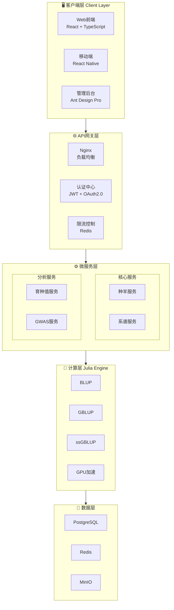

<div align="center">

# 🐑 新星肉羊育种系统

## NovaBreed Sheep System

**国际顶级育种管理平台 | International Top-tier Breeding Management Platform**

[](https://github.com/1958126580/Sheep_breeding/actions)
[](https://opensource.org/licenses/MIT)
[](https://www.python.org/downloads/)
[](https://julialang.org/)
[](https://fastapi.tiangolo.com/)
[](https://react.dev/)
[](https://www.typescriptlang.org/)
[](https://ant.design/)
[](https://github.com/psf/black)
[](CONTRIBUTING.md)
[](https://github.com/1958126580/Sheep_breeding/releases)

[🏠 首页](https://1958126580.github.io/Sheep_breeding/) ·
[📖 文档](https://1958126580.github.io/Sheep_breeding/) ·
[🐛 问题反馈](https://github.com/1958126580/Sheep_breeding/issues) ·
[💡 功能请求](https://github.com/1958126580/Sheep_breeding/issues/new)

---

</div>

## 📖 项目简介

新星肉羊育种系统是**计划对标国际一流水平**的综合性育种管理平台，集成种羊登记、表型记录、基因组数据管理、育种值估计、选种决策支持和可视化工具等核心功能。

The NovaBreed Sheep System is a comprehensive breeding management platform **planned to meet international top-tier standards**, integrating core functions including animal registration, phenotype recording, genomic data management, breeding value estimation, selection decision support, and visualization tools.

<table>
<tr>
<td width="50%">

### 🎯 主要功能

| 模块 | 功能描述                          |
| :--: | :-------------------------------- |
|  🐑  | **种羊管理** - 登记、系谱、分组   |
|  📊  | **表型数据** - 多性状记录与质控   |
|  🧬  | **基因组分析** - SNP、GRM、ROH    |
|  🎯  | **育种估计** - BLUP/GBLUP/ssGBLUP |
|  🔬  | **选种决策** - OCS、选配优化      |
|  📈  | **可视化** - 遗传趋势、曼哈顿图   |
|  🌐  | **多机构协作** - 联邦学习         |
|  🌍  | **国际化** - 中英文双语           |

</td>
<td width="50%">

### 💻 技术栈

| 层级 | 技术                                         |
| :--: | :------------------------------------------- |
|  🖥️  | **前端**: React 18 + TypeScript + Ant Design |
|  ⚙️  | **后端**: Python 3.10+ + FastAPI             |
|  🔬  | **计算**: Julia 1.12.2 + GPU 加速            |
|  💾  | **数据库**: PostgreSQL + Redis               |
|  📦  | **部署**: Docker + Docker Compose            |
|  🔒  | **安全**: JWT + Rate Limiting + CSRF         |

</td>
</tr>
</table>

---

## 🏗️ 系统架构



---

## 🚀 快速开始

### 📋 前置要求

|  依赖   |  版本  | 说明         |
| :-----: | :----: | :----------- |
| Python  | 3.10+  | 后端运行环境 |
|  Julia  | 1.12.2 | 计算引擎     |
| Node.js |  18+   | 前端开发     |
| Docker  |  最新  | 容器化部署   |

### ⚡ 一键部署 (推荐)

```bash
# 1. 克隆仓库
git clone https://github.com/1958126580/Sheep_breeding.git
cd Sheep_breeding

# 2. 启动所有服务
docker-compose up -d

# 3. 访问系统
# 🌐 前端界面: http://localhost:3000
# 📚 API文档:  http://localhost:8000/docs
# 🔧 管理后台: http://localhost:8080
```

### 🛠️ 手动开发环境

<details>
<summary><b>📦 后端设置 (点击展开)</b></summary>

```bash
cd backend

# 创建虚拟环境
python -m venv venv
source venv/bin/activate  # Windows: venv\Scripts\activate

# 安装依赖
pip install -r requirements.txt

# 启动服务
uvicorn main:app --reload --host 0.0.0.0 --port 8000
```

</details>

<details>
<summary><b>🧬 Julia计算引擎 (点击展开)</b></summary>

```bash
cd julia

# 在Julia REPL中
julia --project=.
julia> using Pkg
julia> Pkg.instantiate()
julia> Pkg.precompile()
```

</details>

<details>
<summary><b>🎨 前端设置 (点击展开)</b></summary>

```bash
cd web-frontend

# 安装依赖
npm install

# 启动开发服务器
npm run dev
```

</details>

---

## 📚 文档中心

| 文档 | 描述                            |                  链接                  |
| :--: | :------------------------------ | :------------------------------------: |
|  📖  | **用户手册** - 系统完整使用指南 |     [查看](docs/USER_MANUAL_ZH.md)     |
|  🔌  | **API 文档** - RESTful 接口说明 |         [查看](docs/API_ZH.md)         |
|  💻  | **开发指南** - 环境搭建与贡献   |   [查看](docs/DEVELOPER_GUIDE_ZH.md)   |
|  🧮  | **算法参考** - 育种算法详解     | [查看](docs/ALGORITHM_REFERENCE_ZH.md) |
|  🚀  | **部署指南** - 生产环境配置     |     [查看](docs/DEPLOYMENT_ZH.md)      |
|  📋  | **安装指南** - 详细安装步骤     |    [查看](docs/INSTALLATION_ZH.md)     |
|  ⚡  | **快速入门** - 5 分钟上手       |         [查看](QUICKSTART.md)          |
|  🔒  | **安全策略** - 安全最佳实践     |          [查看](SECURITY.md)           |
|  📝  | **更新日志** - 版本历史         |          [查看](CHANGELOG.md)          |
|  🤝  | **贡献指南** - 如何参与贡献     |        [查看](CONTRIBUTING.md)         |

---

## 📊 性能基准

<table>
<tr>
<th>数据规模</th>
<th>方法</th>
<th>CPU时间</th>
<th>GPU时间</th>
<th>加速比</th>
</tr>
<tr>
<td>10K动物 × 50K SNPs</td>
<td><code>GBLUP</code></td>
<td>45s</td>
<td><b>8s</b></td>
<td>🚀 <b>5.6×</b></td>
</tr>
<tr>
<td>50K动物 × 50K SNPs</td>
<td><code>GBLUP</code></td>
<td>380s</td>
<td><b>52s</b></td>
<td>🚀 <b>7.3×</b></td>
</tr>
<tr>
<td>100K动物 × 50K SNPs</td>
<td><code>ssGBLUP</code></td>
<td>720s</td>
<td><b>95s</b></td>
<td>🚀 <b>7.6×</b></td>
</tr>
</table>

> 📌 **测试环境**: Intel Xeon Gold 6248R (48 核) + NVIDIA A100 40GB

---

## 🧪 测试

```bash
# 后端测试
cd backend && pytest tests/ -v --cov=. --cov-report=html

# Julia测试
cd julia && julia --project=. -e 'using Pkg; Pkg.test()'

# 前端测试
cd web-frontend && npm test
```

---

## 🤝 贡献

我们欢迎所有形式的贡献！

1. 🍴 Fork 本仓库
2. 🌿 创建特性分支 (`git checkout -b feature/AmazingFeature`)
3. 💾 提交更改 (`git commit -m 'Add AmazingFeature'`)
4. 📤 推送分支 (`git push origin feature/AmazingFeature`)
5. 🔄 创建 Pull Request

详情请查看 [贡献指南](CONTRIBUTING.md)。

---

## 👥 团队

|       角色        | 成员                                       |
| :---------------: | :----------------------------------------- |
| 📋 **项目负责人** | [Bujun Mei](https://github.com/1958126580) |
|  🧬 **算法开发**  | AdvancedGenomics Team                      |
|  ⚙️ **系统架构**  | Backend Team                               |
|  🎨 **前端开发**  | Frontend Team                              |

---

## 📈 路线图

- [x] ✅ 核心育种值估计算法 (BLUP/GBLUP/ssGBLUP)
- [x] ✅ Web 前端界面 (React + Ant Design)
- [x] ✅ 移动端应用 (React Native)
- [x] ✅ 深度学习育种值预测
- [x] ✅ GWAS 分析功能
- [x] ✅ 区块链数据溯源
- [x] ✅ 安全性增强 (JWT + Rate Limiting)
- [x] ✅ 数据可视化 (曼哈顿图、遗传趋势图)
- [x] ✅ 多语言支持 (中/英/蒙)
- [x] ✅ 数据导入导出 (Excel/CSV)
- [x] ✅ 报表系统 (自动生成育种报告)
- [x] ✅ 权限管理 (RBAC)
- [ ] 🔄 云端 SaaS 部署

---

## 📮 联系我们

<table>
<tr>
<td>🏠 <b>项目主页</b></td>
<td><a href="https://github.com/1958126580/Sheep_breeding">GitHub Repository</a></td>
</tr>
<tr>
<td>📖 <b>文档网站</b></td>
<td><a href="https://1958126580.github.io/Sheep_breeding/">GitHub Pages</a></td>
</tr>
<tr>
<td>🐛 <b>问题反馈</b></td>
<td><a href="https://github.com/1958126580/Sheep_breeding/issues">Issues</a></td>
</tr>
<tr>
<td>📧 <b>邮箱</b></td>
<td>1958126580@qq.com</td>
</tr>
</table>

---

## 🙏 致谢

- 参考了 **BLUPF90**、**ASReml**、**HIBLUP** 等优秀育种软件
- 使用了 **Julia**、**FastAPI**、**React** 等优秀开源项目
- 感谢所有贡献者的辛勤工作

---

## 📄 许可证

本项目采用 **MIT 许可证** - 查看 [LICENSE](LICENSE) 文件了解详情

---

<div align="center">

**🐑 开源 · 免费 · 学术界和产业界共享 🐑**

**Open Source · Free · For Academia and Industry**

[](https://github.com/1958126580/Sheep_breeding)

</div>
