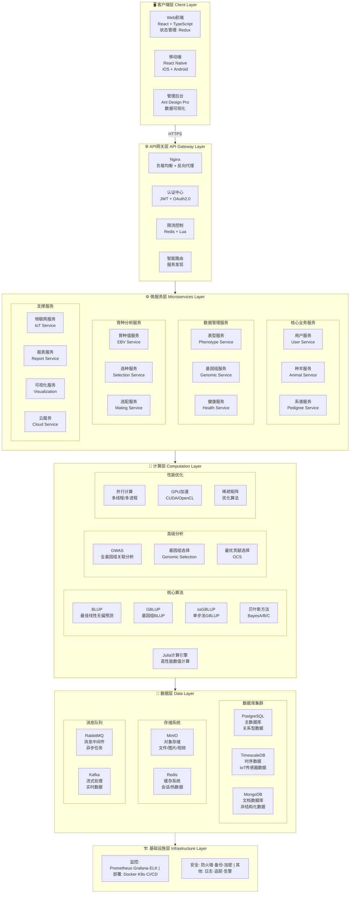

# 新星肉羊育种系统

# NovaBreed Sheep System

[](https://github.com/1958126580/Sheep_breeding/actions)
[](https://opensource.org/licenses/MIT)
[](https://www.python.org/downloads/)
[](https://julialang.org/)
[](https://fastapi.tiangolo.com/)
[](https://github.com/psf/black)
[](CONTRIBUTING.md)
[](https://github.com/1958126580/Sheep_breeding/releases)

## 📖 项目简介 Project Overview

新星肉羊育种系统是计划对标国际一流水平的综合性育种管理平台，集成种羊登记、表型记录、基因组数据管理、育种值估计、选种决策支持和可视化工具等核心功能。系统采用现代微服务架构，支持 Web 端和移动端，具备高性能并行计算和 GPU 加速能力。

The NovaBreed Sheep System is a comprehensive breeding management platform planned to meet international top-tier standards, integrating core functions including animal registration, phenotype recording, genomic data management, breeding value estimation, selection decision support, and visualization tools. The system adopts a modern microservices architecture, supports both Web and mobile platforms, and features high-performance parallel computing and GPU acceleration capabilities.

### ✨ 核心特性 Key Features

- 🐑 **种羊管理** - 完整的种羊登记、系谱管理和分组功能
- 📊 **表型数据** - 多性状表型记录、质量控制和异常检测
- 🧬 **基因组分析** - SNP 质控、基因组关系矩阵构建、ROH 分析
- 🎯 **育种值估计** - BLUP/GBLUP/ssGBLUP/贝叶斯方法，支持 GPU 加速
- 🔬 **选种决策** - 最优贡献选择(OCS)、选配优化、近交控制
- 📈 **可视化** - 遗传趋势图、系谱图、曼哈顿图等
- 🌐 **多机构协作** - 数据共享、权限管理、联邦学习
- 🌍 **国际化** - 完整的中英文双语支持

## 🏗️ 系统架构 System Architecture



## 📚 文档 Documentation

- [用户手册](docs/USER_MANUAL_ZH.md) - 系统使用指南
- [API 文档](docs/API_ZH.md) - RESTful API 接口文档
- [开发者指南](docs/DEVELOPER_GUIDE_ZH.md) - 开发环境搭建和贡献指南
- [算法参考](docs/ALGORITHM_REFERENCE_ZH.md) - 育种算法详细说明
- [部署指南](docs/DEPLOYMENT_ZH.md) - 生产环境部署说明

## 🚀 快速开始 Quick Start

### 前置要求 Prerequisites

- Python 3.10+
- Julia 1.12.2
- PostgreSQL 14+
- Redis 6+
- Node.js 18+ (前端开发)
- Docker & Docker Compose (推荐)

### 使用 Docker 快速部署 Quick Deployment with Docker

```bash
# 克隆仓库
git clone https://github.com/1958126580/Sheep_breeding.git
cd Sheep_breeding

# 启动所有服务
docker-compose up -d

# 查看日志
docker-compose logs -f

# 访问系统
# Web前端: http://localhost:3000
# API文档: http://localhost:8000/docs
# 管理后台: http://localhost:8080
```

### 本地开发环境设置 Local Development Setup

#### 1. 后端设置 Backend Setup

```bash
cd backend

# 创建虚拟环境
python -m venv venv
source venv/bin/activate  # Windows: venv\Scripts\activate

# 安装依赖
pip install -r requirements.txt

# 配置环境变量
cp .env.example .env
# 编辑.env文件，配置数据库连接等

# 初始化数据库
python scripts/init_db.py

# 启动开发服务器
uvicorn main:app --reload --host 0.0.0.0 --port 8000
```

#### 2. Julia 计算引擎设置 Julia Computation Engine Setup

```bash
cd julia

# 激活Julia项目环境
julia --project=.

# 在Julia REPL中
julia> using Pkg
julia> Pkg.instantiate()  # 安装依赖
julia> Pkg.precompile()   # 预编译

# 测试核心模块
julia> include("BreedingCore.jl")
julia> using .BreedingCore
```

#### 3. 前端设置 Frontend Setup

```bash
cd web-frontend

# 安装依赖
npm install

# 启动开发服务器
npm run dev

# 构建生产版本
npm run build
```

## 📚 文档 Documentation

- [用户手册](docs/USER_MANUAL.md) - 系统使用指南
- [API 文档](http://localhost:8000/docs) - RESTful API 接口文档
- [开发者指南](docs/DEVELOPER_GUIDE.md) - 开发环境搭建和贡献指南
- [算法参考](docs/ALGORITHM_REFERENCE.md) - 育种算法详细说明
- [部署指南](docs/DEPLOYMENT.md) - 生产环境部署说明

## 🧪 测试 Testing

### 后端测试 Backend Testing

```bash
cd backend

# 运行所有测试
pytest tests/ -v --cov=. --cov-report=html

# 运行特定测试
pytest tests/test_breeding_values.py -v

# 查看覆盖率报告
open htmlcov/index.html
```

### Julia 测试 Julia Testing

```bash
cd julia

# 运行测试
julia --project=. -e 'using Pkg; Pkg.test()'

# 运行特定模块测试
julia --project=. tests/test_breeding_core.jl
```

### 前端测试 Frontend Testing

```bash
cd web-frontend

# 运行单元测试
npm test

# 运行E2E测试
npm run test:e2e
```

## 📊 性能基准 Performance Benchmarks

| 数据规模             | 方法    | CPU 时间 | GPU 时间 | 加速比 |
| -------------------- | ------- | -------- | -------- | ------ |
| 10K 动物 × 50K SNPs  | GBLUP   | 45s      | 8s       | 5.6×   |
| 50K 动物 × 50K SNPs  | GBLUP   | 380s     | 52s      | 7.3×   |
| 100K 动物 × 50K SNPs | ssGBLUP | 720s     | 95s      | 7.6×   |

_测试环境: Intel Xeon Gold 6248R (48 核) + NVIDIA A100 40GB_

## 🤝 贡献 Contributing

我们欢迎所有形式的贡献！请查看[贡献指南](CONTRIBUTING.md)了解详情。

We welcome all forms of contributions! Please see [Contributing Guide](CONTRIBUTING.md) for details.

### 开发流程 Development Workflow

1. Fork 本仓库
2. 创建特性分支 (`git checkout -b feature/AmazingFeature`)
3. 提交更改 (`git commit -m 'Add some AmazingFeature'`)
4. 推送到分支 (`git push origin feature/AmazingFeature`)
5. 开启 Pull Request

## 📄 许可证 License

本项目采用 MIT 许可证 - 查看[LICENSE](LICENSE)文件了解详情

This project is licensed under the MIT License - see the [LICENSE](LICENSE) file for details

## 👥 团队 Team

- **项目负责人** - [Bujun Mei](https://github.com/1958126580)
- **算法开发** - AdvancedGenomics Team
- **系统架构** - Backend Team
- **前端开发** - Frontend Team

## 📮 联系我们 Contact

- 项目主页: https://github.com/1958126580/Sheep_breeding
- 问题反馈: https://github.com/1958126580/Sheep_breeding/issues
- 邮箱: 1958126580@qq.com

## 🙏 致谢 Acknowledgments

- 感谢所有贡献者的辛勤工作
- 参考了 BLUPF90、ASReml、HIBLUP 等优秀育种软件
- 使用了 Julia、FastAPI、React 等优秀开源项目

## 📈 路线图 Roadmap

- [x] 核心育种值估计算法
- [x] 基础 Web 界面
- [x] 移动端应用
- [x] 深度学习育种值预测
- [x] GWAS 分析功能
- [x] 区块链数据溯源
- [x] 云端 SaaS 部署

---

**开源 · 免费 · 学术界和产业界共享**

**Open Source · Free · For Academia and Industry**
