# 国际顶级肉羊育种系统

## 完整用户使用手册

**版本**: 2.0.0  
**更新日期**: 2024 年 12 月  
**适用对象**: 育种技术人员、羊场管理者、科研人员

---

## 📑 目录

1. [系统概览](#一系统概览)
2. [技术架构](#二技术架构)
3. [快速开始](#三快速开始)
4. [核心功能详解](#四核心功能详解)
5. [数据流程](#五数据流程)
6. [云端服务与协作](#六云端服务与协作)
7. [API 使用指南](#七api使用指南)
8. [最佳实践](#八最佳实践)
9. [性能优化](#九性能优化)
10. [故障排查](#十故障排查)

---

## 一、系统概览

### 1.1 系统定位

国际顶级肉羊育种系统是一个**全栈式智能育种管理平台**，整合了：

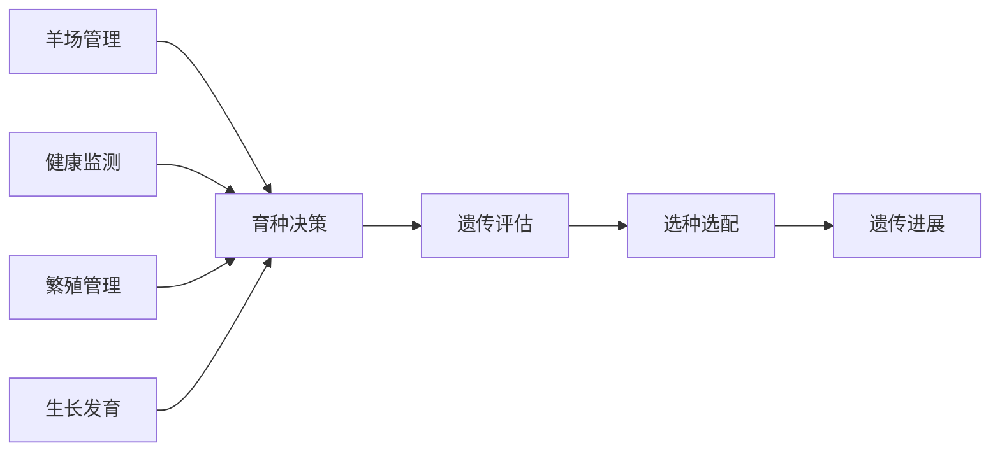

### 1.2 核心价值

| 价值点         | 传统方式 | 本系统     | 提升               |
| -------------- | -------- | ---------- | ------------------ |
| **数据记录**   | 纸质记录 | 数字化采集 | 效率提升 80%       |
| **育种值估计** | 外包评估 | 实时计算   | 成本降低 90%       |
| **选配决策**   | 人工经验 | 智能优化   | 准确率提升 50%     |
| **遗传进展**   | 年度统计 | 实时监控   | 决策速度提升 10 倍 |

### 1.3 系统特色

#### 🎯 国际顶级算法

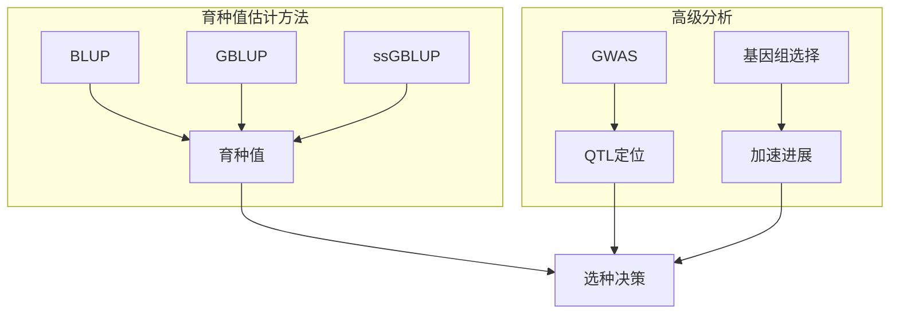

#### ⚡ 高性能计算

- **Julia 计算引擎**: 接近 C 语言的性能
- **GPU 加速**: 大规模数据 7 倍加速
- **并行计算**: 多核 CPU 充分利用
- **稀疏矩阵**: 内存占用降低 90%

#### 🔗 全流程管理

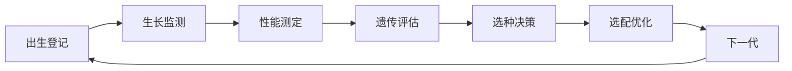

---

## 二、技术架构

### 2.1 整体架构图

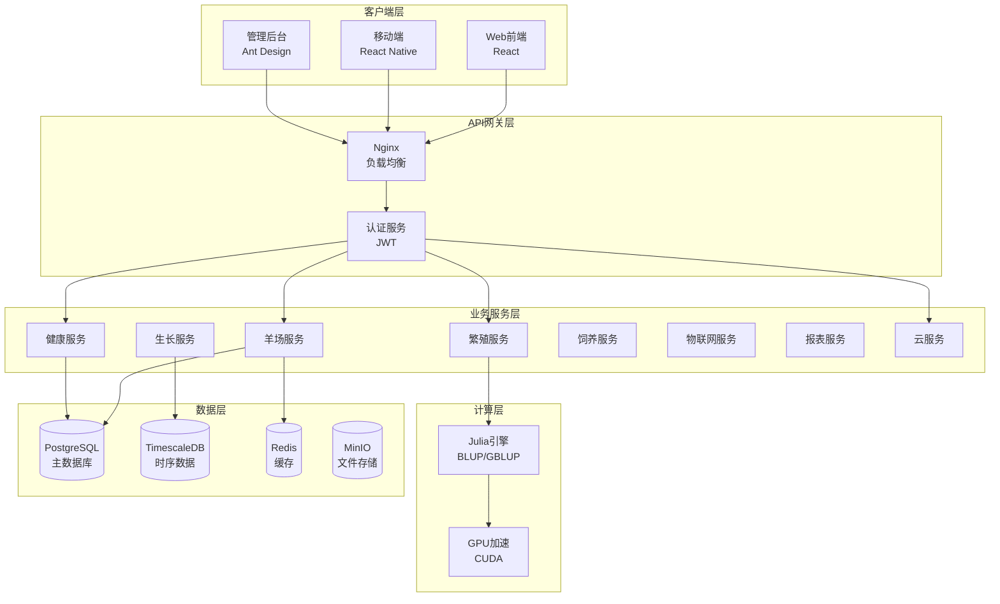

### 2.2 数据库设计

#### 核心表结构

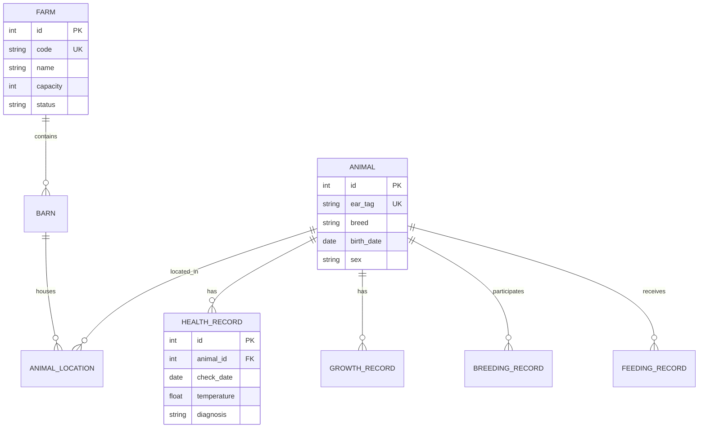

### 2.3 服务层架构

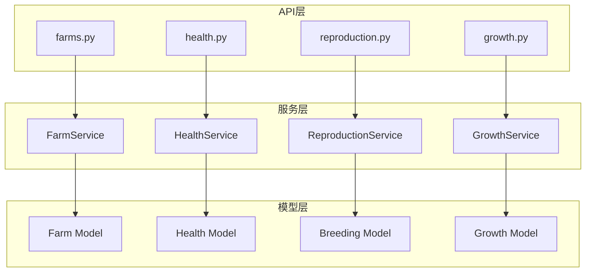

---

## 三、快速开始

### 3.1 Docker 一键部署

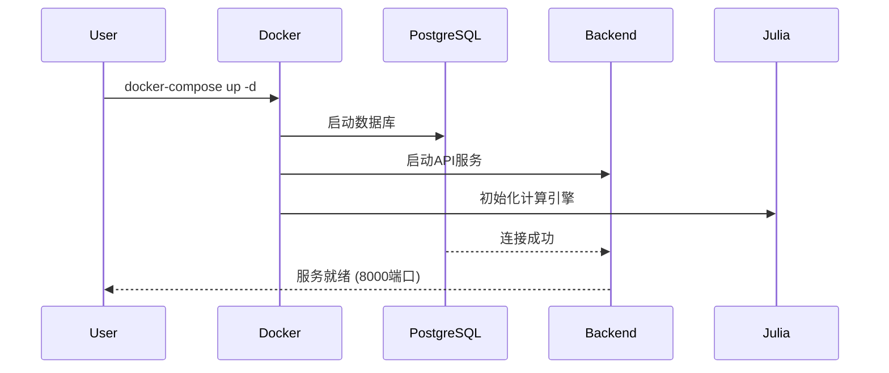

#### 部署步骤

```bash
# 1. 克隆代码
git clone <repository-url>
cd sheep-breeding-system

# 2. 配置环境变量
cp .env.example .env
# 编辑.env文件，设置数据库密码等

# 3. 启动所有服务
docker-compose up -d

# 4. 查看服务状态
docker-compose ps

# 5. 查看日志
docker-compose logs -f backend

# 6. 初始化数据库
docker-compose exec backend python scripts/init_db.py

# 7. 创建管理员账户
docker-compose exec backend python scripts/create_admin.py
```

#### 访问系统

| 服务     | 地址                       | 说明       |
| -------- | -------------------------- | ---------- |
| API 文档 | http://localhost:8000/docs | Swagger UI |
| Web 前端 | http://localhost:3000      | 用户界面   |
| 管理后台 | http://localhost:8080      | 系统管理   |
| 数据库   | localhost:5432             | PostgreSQL |

### 3.2 手动部署流程

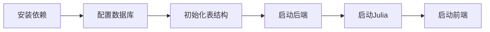

---

## 四、核心功能详解

### 4.1 羊场管理模块

#### 功能架构

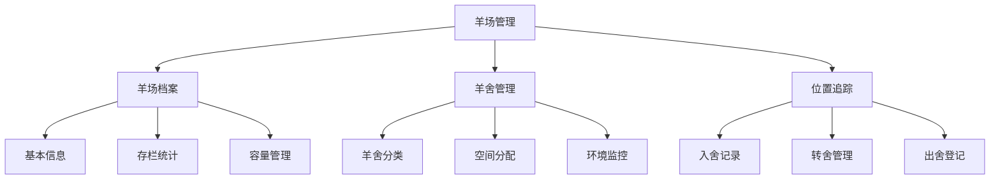

#### 使用示例

**创建羊场**

```python
# API调用示例
import requests

# 创建羊场
farm_data = {
    "code": "FARM001",
    "name": "核心育种场",
    "farm_type": "breeding",  # breeding/commercial/mixed
    "capacity": 1000,
    "area": 50.5,  # 占地面积(亩)
    "location": "内蒙古自治区锡林郭勒盟",
    "manager_name": "张经理",
    "contact_phone": "13800138000"
}

response = requests.post(
    "http://localhost:8000/api/v1/farms",
    json=farm_data
)

farm = response.json()
print(f"羊场创建成功，ID: {farm['id']}")
```

**创建羊舍**

```python
# 创建种公羊舍
barn_data = {
    "farm_id": farm['id'],
    "code": "B01",
    "name": "1号种公羊舍",
    "barn_type": "ram",  # ram/ewe/lamb/fattening
    "capacity": 50,
    "area": 200.0,  # 面积(平方米)
    "status": "active"
}

response = requests.post(
    "http://localhost:8000/api/v1/barns",
    json=barn_data
)
```

**羊场仪表板数据**

```python
# 获取羊场概览
response = requests.get(
    f"http://localhost:8000/api/v1/farms/{farm['id']}/dashboard"
)

dashboard = response.json()
# {
#     "farm_id": 1,
#     "farm_name": "核心育种场",
#     "total_animals": 850,
#     "barns_count": 12,
#     "capacity": 1000,
#     "capacity_usage": 85.0,
#     "status": "active"
# }
```

### 4.2 健康管理模块

#### 健康管理流程

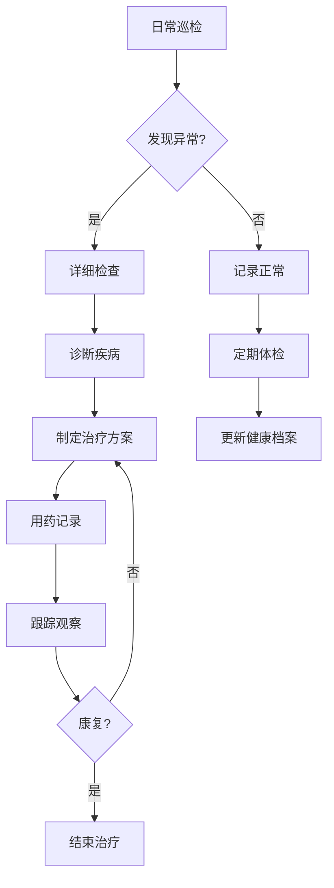

#### 疫苗接种管理

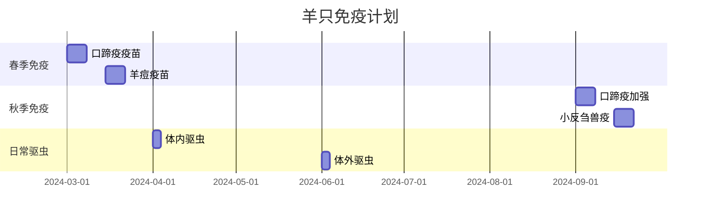

#### 代码示例

```python
# 创建健康检查记录
health_record = {
    "animal_id": 123,
    "check_date": "2024-06-15",
    "check_type": "routine",  # routine/emergency/periodic
    "body_temperature": 39.2,
    "body_weight": 45.5,
    "body_condition_score": 3,  # 1-5分
    "symptoms": "",
    "diagnosis": "健康",
    "notes": "状态良好，继续观察"
}

response = requests.post(
    "http://localhost:8000/api/v1/health/records",
    json=health_record
)

# 创建疫苗接种记录
vaccination = {
    "animal_id": 123,
    "vaccine_type_id": 1,
    "vaccine_name": "口蹄疫疫苗",
    "vaccine_batch": "20240301",
    "dosage": "2ml",
    "vaccination_date": "2024-03-01",
    "next_vaccination_date": "2024-09-01",
    "administered_by": "李兽医"
}

response = requests.post(
    "http://localhost:8000/api/v1/health/vaccinations",
    json=vaccination
)
```

### 4.3 繁殖管理模块

#### 繁殖周期管理

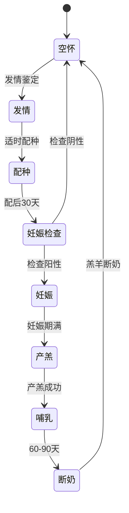

#### 繁殖性能指标

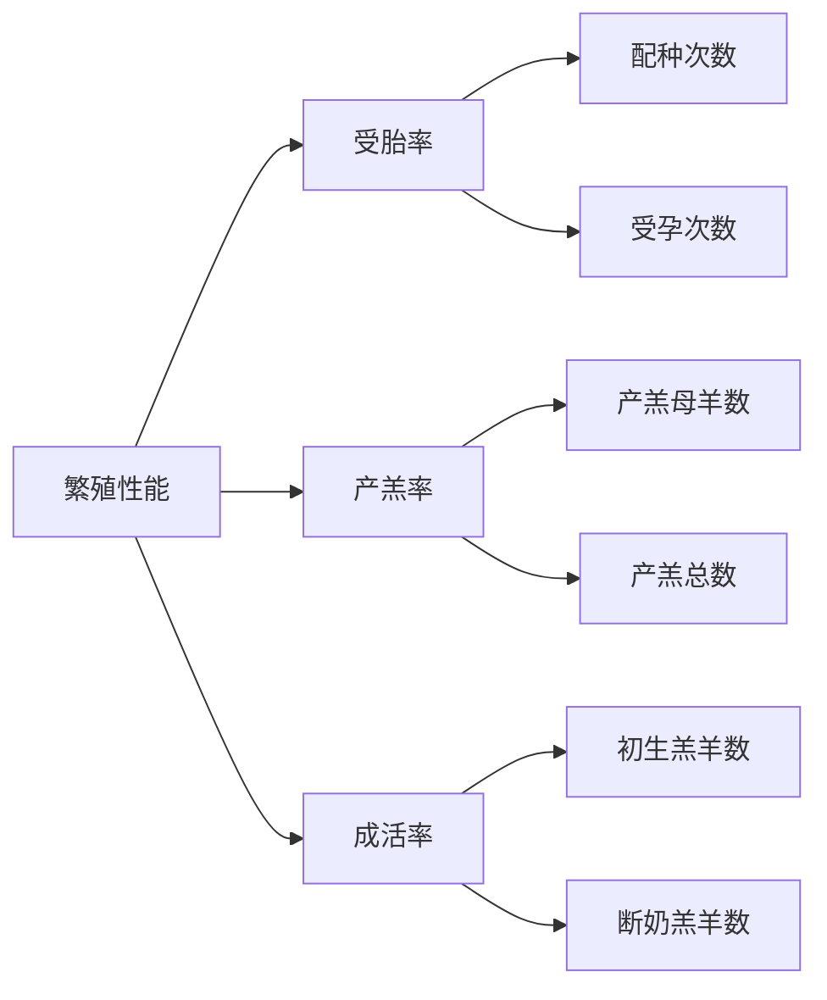

#### 代码示例

```python
# 记录发情
estrus_record = {
    "ewe_id": 100,
    "estrus_date": "2024-06-01",
    "estrus_intensity": "strong",  # weak/moderate/strong
    "detection_method": "visual",  # visual/teaser/device
    "notes": "发情表现明显"
}

# 记录配种
breeding_record = {
    "ewe_id": 100,
    "ram_id": 5,
    "breeding_date": "2024-06-02",
    "breeding_method": "AI",  # natural/AI/ET
    "semen_batch": "20240601",
    "technician": "王技术员"
}

# 记录妊娠检查
pregnancy_check = {
    "breeding_record_id": 1,
    "check_date": "2024-07-02",
    "check_method": "ultrasound",  # palpation/ultrasound
    "result": "pregnant",  # pregnant/not_pregnant/uncertain
    "expected_lambing_date": "2024-10-30"
}

# 记录产羔
lambing_record = {
    "pregnancy_record_id": 1,
    "lambing_date": "2024-10-28",
    "litter_size": 2,
    "lambs_born_alive": 2,
    "lambs_born_dead": 0,
    "birth_weights": [3.2, 3.5],  # kg
    "difficulty": "normal"  # normal/assisted/difficult
}
```

### 4.4 育种值估计模块

#### BLUP 方法原理

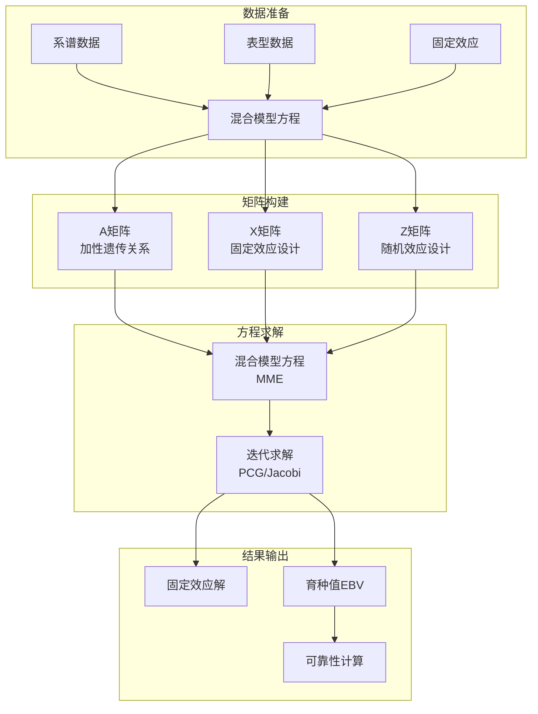

#### GBLUP vs BLUP

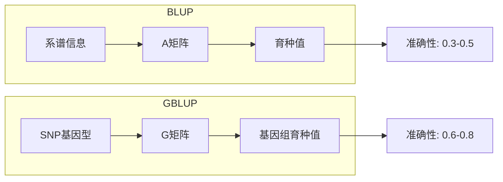

#### 运行育种值估计

```python
# 创建评估任务
run_config = {
    "run_name": "2024年断奶重GBLUP评估",
    "trait_id": 2,  # 断奶重性状
    "method": "GBLUP",  # BLUP/GBLUP/ssGBLUP
    "model_specification": {
        "h2": 0.35,  # 遗传力
        "fixed_effects": ["sex", "birth_type", "farm"],
        "random_effects": ["contemporary_group"],
        "covariates": ["age_at_measurement"]
    },
    "use_gpu": True,
    "max_iterations": 1000,
    "convergence_criterion": 1e-8
}

response = requests.post(
    "http://localhost:8000/api/v1/breeding-values/runs",
    json=run_config
)

run_id = response.json()['id']

# 查询评估状态
status_response = requests.get(
    f"http://localhost:8000/api/v1/breeding-values/runs/{run_id}"
)

# 获取评估结果
results_response = requests.get(
    f"http://localhost:8000/api/v1/breeding-values/runs/{run_id}/results"
)

results = results_response.json()
# {
#     "run_id": 1,
#     "status": "completed",
#     "animals_evaluated": 1500,
#     "mean_reliability": 0.72,
#     "genetic_variance": 2.45,
#     "residual_variance": 4.55,
#     "heritability": 0.35
# }
```

---

## 五、数据流程

### 5.1 数据采集流程

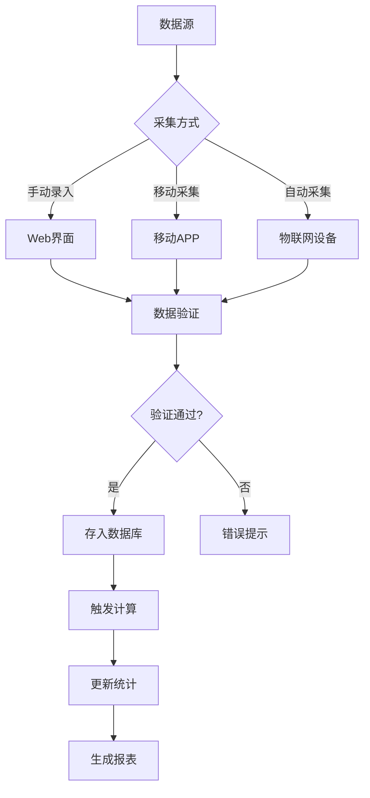

### 5.2 育种值计算流程

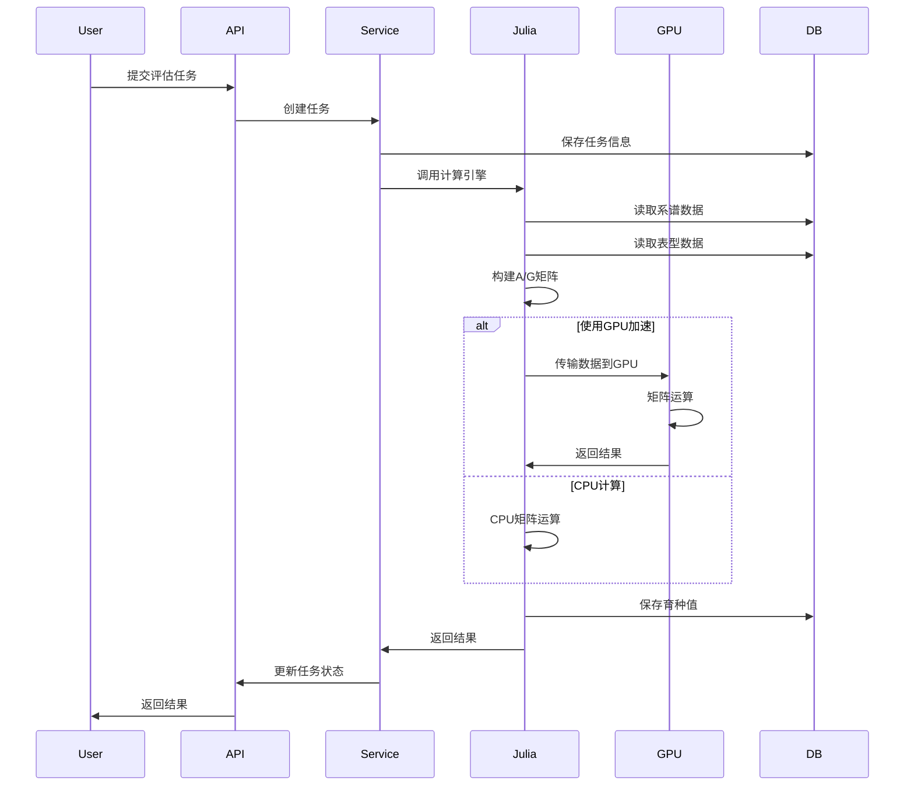

---

## 六、云端服务与协作

### 6.1 云端同步

系统支持多端数据自动同步，确保 Web 端、移动端和本地数据的一致性。

- **同步机制**: 增量同步，仅传输变化数据
- **冲突解决**: 自动检测版本冲突，保留最新或手动合并
- **离线支持**: 移动端支持离线记录，联网后自动同步

### 6.2 数据共享协议

支持不同育种机构间的数据共享，促进联合育种。

- **协议创建**: 指定共享方、数据类型（如系谱、表型）、有效期
- **权限控制**: 可设置只读、读写权限
- **共享审计**: 记录所有数据访问和操作日志

### 6.3 数据导入导出

提供强大的数据交换功能。

- **导入**: 支持 Excel 模板批量导入动物、繁殖、生长数据
- **导出**: 支持导出为 Excel、PDF 报表，或符合育种软件（如 ASReml）格式的数据文件

---

## 七、API 使用指南

### 6.1 认证流程

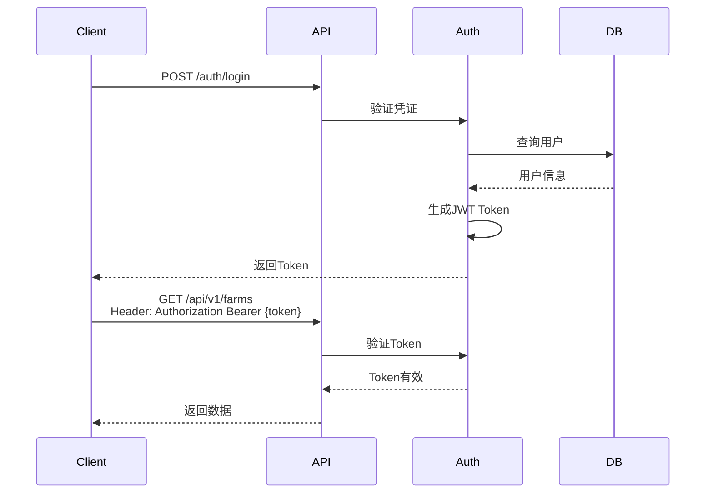

### 7.2 API 接口清单

#### 羊场管理 (6 个端点)

| 方法   | 路径                           | 说明         |
| ------ | ------------------------------ | ------------ |
| GET    | `/api/v1/farms`                | 获取羊场列表 |
| POST   | `/api/v1/farms`                | 创建羊场     |
| GET    | `/api/v1/farms/{id}`           | 获取羊场详情 |
| PUT    | `/api/v1/farms/{id}`           | 更新羊场信息 |
| DELETE | `/api/v1/farms/{id}`           | 删除羊场     |
| GET    | `/api/v1/farms/{id}/dashboard` | 羊场仪表板   |

#### 健康管理 (10 个端点)

| 方法 | 路径                           | 说明         |
| ---- | ------------------------------ | ------------ |
| GET  | `/api/v1/health/records`       | 健康记录列表 |
| POST | `/api/v1/health/records`       | 创建健康记录 |
| GET  | `/api/v1/health/vaccinations`  | 疫苗记录列表 |
| POST | `/api/v1/health/vaccinations`  | 创建疫苗记录 |
| GET  | `/api/v1/health/dewormings`    | 驱虫记录列表 |
| POST | `/api/v1/health/dewormings`    | 创建驱虫记录 |
| GET  | `/api/v1/health/diseases`      | 疾病档案列表 |
| POST | `/api/v1/health/diseases`      | 创建疾病档案 |
| GET  | `/api/v1/health/vaccine-types` | 疫苗类型列表 |
| POST | `/api/v1/health/vaccine-types` | 创建疫苗类型 |

#### 云端服务 (6 个端点)

| 方法 | 路径                             | 说明         |
| ---- | -------------------------------- | ------------ |
| POST | `/api/v1/cloud/sync/start`       | 启动数据同步 |
| POST | `/api/v1/cloud/import`           | 导入数据     |
| POST | `/api/v1/cloud/export`           | 导出数据     |
| POST | `/api/v1/cloud/share/agreements` | 创建共享协议 |

### 7.3 请求示例

```bash
# 获取羊场列表（带分页和过滤）
curl -X GET "http://localhost:8000/api/v1/farms?skip=0&limit=20&farm_type=breeding" \
  -H "Authorization: Bearer {token}"

# 创建健康记录
curl -X POST "http://localhost:8000/api/v1/health/records" \
  -H "Authorization: Bearer {token}" \
  -H "Content-Type: application/json" \
  -d '{
    "animal_id": 123,
    "check_date": "2024-06-15",
    "check_type": "routine",
    "body_temperature": 39.2,
    "body_weight": 45.5
  }'

# 运行育种值评估
curl -X POST "http://localhost:8000/api/v1/breeding-values/runs" \
  -H "Authorization: Bearer {token}" \
  -H "Content-Type: application/json" \
  -d '{
    "run_name": "2024年断奶重评估",
    "trait_id": 2,
    "method": "GBLUP",
    "use_gpu": true
  }'
```

---

## 八、最佳实践

### 7.1 数据录入规范

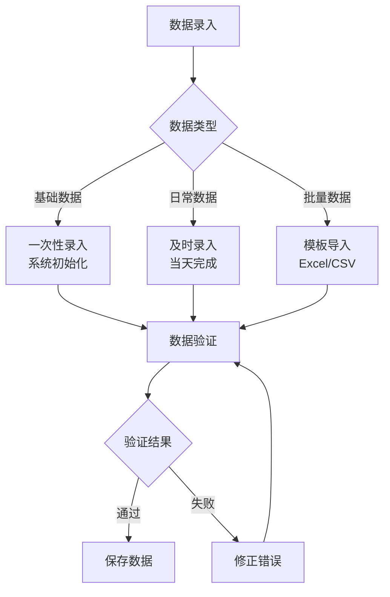

### 7.2 育种值评估建议

| 评估频率     | 性状类型 | 推荐方法 | 说明               |
| ------------ | -------- | -------- | ------------------ |
| **季度评估** | 生长性状 | GBLUP    | 快速更新，指导选种 |
| **年度评估** | 繁殖性状 | ssGBLUP  | 综合系谱和基因组   |
| **专项评估** | 新性状   | BLUP     | 数据积累阶段       |

### 7.3 系统维护建议

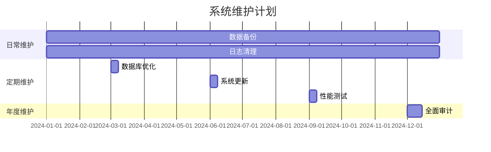

---

## 九、性能优化

### 8.1 数据库优化

```sql
-- 创建索引加速查询
CREATE INDEX idx_animal_ear_tag ON animals(ear_tag);
CREATE INDEX idx_health_animal_date ON health_records(animal_id, check_date);
CREATE INDEX idx_growth_animal_date ON growth_records(animal_id, measurement_date);

-- 分区表优化（时序数据）
CREATE TABLE iot_data_2024 PARTITION OF iot_data
    FOR VALUES FROM ('2024-01-01') TO ('2025-01-01');
```

### 8.2 缓存策略

```mermaid
graph LR
    A[请求] --> B{Redis缓存}
    B -->|命中| C[返回缓存]
    B -->|未命中| D[查询数据库]
    D --> E[写入缓存]
    E --> F[返回数据]
```

### 8.3 性能基准

| 操作                | 数据量   | CPU 时间 | GPU 时间 | 加速比 |
| ------------------- | -------- | -------- | -------- | ------ |
| GBLUP (10K 动物)    | 50K SNPs | 45s      | 8s       | 5.6×   |
| GBLUP (50K 动物)    | 50K SNPs | 380s     | 52s      | 7.3×   |
| ssGBLUP (100K 动物) | 50K SNPs | 720s     | 95s      | 7.6×   |

---

## 十、故障排查

### 9.1 常见问题

```mermaid
graph TB
    A[系统问题] --> B{问题类型}

    B -->|连接失败| C[检查网络]
    B -->|性能慢| D[检查负载]
    B -->|数据错误| E[检查日志]

    C --> C1[ping服务器]
    C --> C2[检查防火墙]

    D --> D1[查看CPU/内存]
    D --> D2[检查数据库连接]

    E --> E1[查看错误日志]
    E --> E2[数据验证]
```

### 9.2 日志查看

```bash
# 查看后端日志
docker-compose logs -f backend

# 查看数据库日志
docker-compose logs -f postgres

# 查看Julia计算日志
tail -f logs/julia_computation.log
```

### 9.3 性能监控

```bash
# 查看系统资源
docker stats

# 查看数据库连接
psql -U postgres -c "SELECT * FROM pg_stat_activity;"

# 查看Redis状态
redis-cli INFO
```

---

## 📞 技术支持

- **文档**: [在线文档](https://docs.example.com)
- **API 参考**: http://localhost:8000/docs
- **问题反馈**: GitHub Issues
- **邮箱**: 1958126580@qq.com

---

**© 2024 国际顶级肉羊育种系统. All Rights Reserved.**
