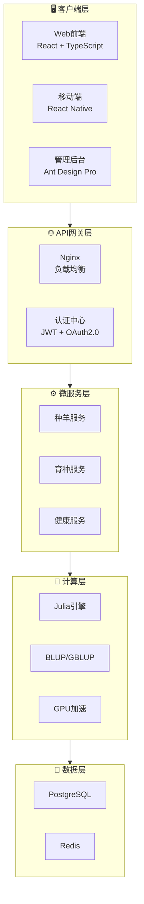

# 🐑 新星肉羊育种系统

## NovaBreed Sheep System

<p align="center">
<strong>国际顶级育种管理平台 | International Top-tier Breeding Management Platform</strong>
</p>

<p align="center">
<a href="https://github.com/1958126580/Sheep_breeding/actions"></a>
<a href="https://opensource.org/licenses/MIT"></a>
<a href="https://www.python.org/downloads/"></a>
<a href="https://julialang.org/"></a>
<a href="https://fastapi.tiangolo.com/"></a>
<a href="https://react.dev/"></a>
<a href="https://www.typescriptlang.org/"></a>
<a href="https://ant.design/"></a>
</p>

---

## 📖 项目简介

新星肉羊育种系统是**计划对标国际一流水平**的综合性育种管理平台，集成种羊登记、表型记录、基因组数据管理、育种值估计、选种决策支持和可视化工具等核心功能。

The NovaBreed Sheep System is a comprehensive breeding management platform **planned to meet international top-tier standards**, integrating core functions including animal registration, phenotype recording, genomic data management, breeding value estimation, selection decision support, and visualization tools.

---

## ✨ 核心特性

|     功能模块      | 描述                                    |
| :---------------: | :-------------------------------------- |
|  🐑 **种羊管理**  | 完整的种羊登记、系谱管理和分组功能      |
|  📊 **表型数据**  | 多性状表型记录、质量控制和异常检测      |
| 🧬 **基因组分析** | SNP 质控、基因组关系矩阵构建、ROH 分析  |
| 🎯 **育种值估计** | BLUP/GBLUP/ssGBLUP/贝叶斯方法，GPU 加速 |
|  🔬 **选种决策**  | 最优贡献选择(OCS)、选配优化、近交控制   |
|   📈 **可视化**   | 遗传趋势图、系谱图、曼哈顿图等          |
| 🌐 **多机构协作** | 数据共享、权限管理、联邦学习            |
|   🌍 **国际化**   | 完整的中英文双语支持                    |

---

## 💻 技术栈

|     层级      | 技术                                 |
| :-----------: | :----------------------------------- |
|  🖥️ **前端**  | React 18 + TypeScript + Ant Design 5 |
|  ⚙️ **后端**  | Python 3.10+ + FastAPI               |
|  🔬 **计算**  | Julia 1.12.2 + CUDA GPU 加速         |
| 💾 **数据库** | PostgreSQL + Redis + TimescaleDB     |
|  📦 **部署**  | Docker + Docker Compose + Nginx      |
|  🔒 **安全**  | JWT 认证 + Rate Limiting + CSRF 防护 |

---

## 🏗️ 系统架构



---

## 📚 文档导航

!!! tip "快速开始"
新用户请先阅读 [快速入门](QUICKSTART.md) 指南

| 文档                                     | 描述             |
| :--------------------------------------- | :--------------- |
| 📖 [用户手册](USER_MANUAL_ZH.md)         | 系统完整使用指南 |
| 🔌 [API 文档](API_ZH.md)                 | RESTful 接口说明 |
| 💻 [开发者指南](DEVELOPER_GUIDE_ZH.md)   | 环境搭建与贡献   |
| 🧮 [算法参考](ALGORITHM_REFERENCE_ZH.md) | 育种算法详解     |
| 🚀 [部署指南](DEPLOYMENT_ZH.md)          | 生产环境配置     |
| 📋 [安装指南](INSTALLATION_ZH.md)        | 详细安装步骤     |
| 🔒 [安全策略](SECURITY.md)               | 安全最佳实践     |
| 📝 [更新日志](CHANGELOG.md)              | 版本历史         |
| 🤝 [贡献指南](CONTRIBUTING.md)           | 如何参与贡献     |

---

## 🚀 快速开始

### ⚡ 一键部署 (推荐)

```bash
# 1. 克隆仓库
git clone https://github.com/1958126580/Sheep_breeding.git
cd Sheep_breeding

# 2. 启动所有服务
docker-compose up -d

# 3. 访问系统
# 🌐 前端界面: http://localhost:3000
# 📚 API文档:  http://localhost:8000/docs
# 🔧 管理后台: http://localhost:8080
```

### 📋 前置要求

|  依赖   |  版本  | 说明         |
| :-----: | :----: | :----------- |
| Python  | 3.10+  | 后端运行环境 |
|  Julia  | 1.12.2 | 计算引擎     |
| Node.js |  18+   | 前端开发     |
| Docker  |  最新  | 容器化部署   |

---

## 📊 性能基准

| 数据规模             |  方法   | CPU 时间 | GPU 时间 |   加速比    |
| :------------------- | :-----: | :------: | :------: | :---------: |
| 10K 动物 × 50K SNPs  |  GBLUP  |   45s    |  **8s**  | 🚀 **5.6×** |
| 50K 动物 × 50K SNPs  |  GBLUP  |   380s   | **52s**  | 🚀 **7.3×** |
| 100K 动物 × 50K SNPs | ssGBLUP |   720s   | **95s**  | 🚀 **7.6×** |

> 📌 **测试环境**: Intel Xeon Gold 6248R (48 核) + NVIDIA A100 40GB

---

## 🧪 测试

```bash
# 后端测试
cd backend && pytest tests/ -v --cov=.

# Julia测试
cd julia && julia --project=. -e 'using Pkg; Pkg.test()'

# 前端测试
cd web-frontend && npm test
```

---

## 🤝 贡献

我们欢迎所有形式的贡献！

1. 🍴 Fork 本仓库
2. 🌿 创建特性分支 (`git checkout -b feature/AmazingFeature`)
3. 💾 提交更改 (`git commit -m 'Add AmazingFeature'`)
4. 📤 推送分支 (`git push origin feature/AmazingFeature`)
5. 🔄 创建 Pull Request

详情请查看 [贡献指南](CONTRIBUTING.md)。

---

## 👥 团队

|       角色        | 成员                                       |
| :---------------: | :----------------------------------------- |
| 📋 **项目负责人** | [Bujun Mei](https://github.com/1958126580) |
|  🧬 **算法开发**  | AdvancedGenomics Team                      |
|  ⚙️ **系统架构**  | Backend Team                               |
|  🎨 **前端开发**  | Frontend Team                              |

---

## 📈 路线图

- [x] ✅ 核心育种值估计算法 (BLUP/GBLUP/ssGBLUP)
- [x] ✅ Web 前端界面 (React + Ant Design)
- [x] ✅ 移动端应用 (React Native)
- [x] ✅ 深度学习育种值预测
- [x] ✅ GWAS 分析功能
- [x] ✅ 区块链数据溯源
- [x] ✅ 安全性增强 (JWT + Rate Limiting)
- [ ] 🔄 云端 SaaS 部署

---

## 📮 联系我们

|      渠道       | 链接                                                                      |
| :-------------: | :------------------------------------------------------------------------ |
|  🏠 **GitHub**  | [1958126580/Sheep_breeding](https://github.com/1958126580/Sheep_breeding) |
| 🐛 **问题反馈** | [Issues](https://github.com/1958126580/Sheep_breeding/issues)             |
|   📧 **邮箱**   | 1958126580@qq.com                                                         |

---

## 🙏 致谢

- 参考了 **BLUPF90**、**ASReml**、**HIBLUP** 等优秀育种软件
- 使用了 **Julia**、**FastAPI**、**React** 等优秀开源项目
- 感谢所有贡献者的辛勤工作

---

## 📄 许可证

本项目采用 **MIT 许可证** - 查看 [LICENSE](https://github.com/1958126580/Sheep_breeding/blob/main/LICENSE) 文件了解详情

---

<p align="center">
<strong>🐑 开源 · 免费 · 学术界和产业界共享 🐑</strong>
<br>
<strong>Open Source · Free · For Academia and Industry</strong>
</p>
