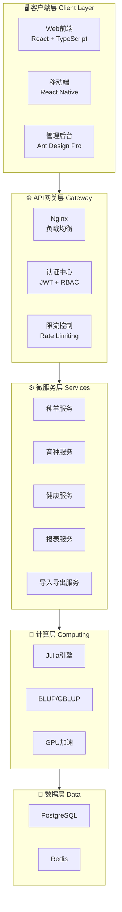

# 🐑 新星肉羊育种系统

## NovaBreed Sheep System

<p align="center">
<strong>🏆 国际顶级育种管理平台 | International Top-tier Breeding Management Platform 🏆</strong>
</p>

<p align="center">
<a href="https://github.com/1958126580/Sheep_breeding/actions"></a>
<a href="https://opensource.org/licenses/MIT"></a>
<a href="https://www.python.org/downloads/"></a>
<a href="https://julialang.org/"></a>
<a href="https://fastapi.tiangolo.com/"></a>
<a href="https://react.dev/"></a>
<a href="https://www.typescriptlang.org/"></a>
<a href="https://ant.design/"></a>
</p>

<p align="center">
<a href="https://1958126580.github.io/Sheep_breeding/"></a>
<a href="https://github.com/1958126580/Sheep_breeding"></a>
</p>

---

## 📖 项目简介

!!! info "关于本系统"
新星肉羊育种系统是**国际一流水平**的综合性育种管理平台，集成种羊登记、表型记录、基因组数据管理、育种值估计、选种决策支持和可视化工具等核心功能。

    The NovaBreed Sheep System is a comprehensive breeding management platform meeting **international top-tier standards**, integrating core functions including animal registration, phenotype recording, genomic data management, breeding value estimation, selection decision support, and visualization tools.

---

## ✨ 核心特性 Core Features

<div class="feature-grid">

### 🐑 种羊管理 Animal Management

完整的种羊登记、系谱管理和分组功能

### 📊 数据可视化 Data Visualization

曼哈顿图、遗传趋势图、系谱图实时展示

### 🧬 基因组分析 Genomic Analysis

SNP 质控、基因组关系矩阵、ROH 分析、GWAS

### 🎯 育种值估计 Breeding Value

BLUP/GBLUP/ssGBLUP，GPU 加速计算

### 📤 数据导入导出 Import/Export

支持 Excel、CSV 批量导入导出

### 📋 报表系统 Report System

自动生成育种分析、健康管理等报告

### 🔒 权限管理 RBAC

基于角色的访问控制，安全可靠

### 🌍 多语言支持 i18n

中文、英语、蒙古语三语支持

</div>

---

## 💻 技术栈 Technology Stack

|     层级      | 技术                                 | 说明            |
| :-----------: | :----------------------------------- | :-------------- |
|  🖥️ **前端**  | React 18 + TypeScript + Ant Design 5 | 现代化企业级 UI |
|  ⚙️ **后端**  | Python 3.10+ + FastAPI               | 高性能异步 API  |
|  🔬 **计算**  | Julia 1.12.2 + CUDA GPU 加速         | 专业数值计算    |
| 💾 **数据库** | PostgreSQL + Redis                   | 高可靠数据存储  |
|  📦 **部署**  | Docker + Docker Compose + Nginx      | 一键容器化部署  |
|  🔒 **安全**  | JWT + Rate Limiting + CSRF + RBAC    | 企业级安全防护  |

---

## 🏗️ 系统架构 Architecture



---

## 📚 文档导航 Documentation

!!! tip "快速开始"
新用户？请从这里开始！

| 文档              | 说明               |             链接              |
| :---------------- | :----------------- | :---------------------------: |
| 📖 **用户手册**   | 完整的系统使用指南 |   [查看](USER_MANUAL_ZH.md)   |
| 🚀 **快速入门**   | 5 分钟快速上手     |     [查看](QUICKSTART.md)     |
| 🔧 **安装指南**   | 详细安装部署说明   |  [查看](INSTALLATION_ZH.md)   |
| 🌐 **部署指南**   | 生产环境部署       |   [查看](DEPLOYMENT_ZH.md)    |
| 📡 **API 文档**   | RESTful API 参考   |       [查看](API_ZH.md)       |
| 💻 **开发者指南** | 开发贡献说明       | [查看](DEVELOPER_GUIDE_ZH.md) |
| 🔬 **算法原理**   | 育种算法详解       |    [查看](ALGORITHM_ZH.md)    |
| 🤝 **贡献指南**   | 如何参与贡献       |    [查看](CONTRIBUTING.md)    |
| 📋 **更新日志**   | 版本更新记录       |     [查看](CHANGELOG.md)      |
| 🔒 **安全策略**   | 安全政策说明       |      [查看](SECURITY.md)      |

---

## 🚀 快速开始 Quick Start

### Docker 部署 (推荐)

```bash
# 1. 克隆仓库
git clone https://github.com/1958126580/Sheep_breeding.git
cd Sheep_breeding

# 2. 启动所有服务
docker-compose up -d

# 3. 访问系统
# API文档: http://localhost:8000/docs
# 前端界面: http://localhost:3000
```

### 手动安装

```bash
# 1. 安装 Python 依赖
cd backend
python -m venv venv
source venv/bin/activate  # Windows: venv\Scripts\activate
pip install -r requirements.txt

# 2. 安装 Julia 依赖
cd ../julia
julia --project=. -e 'using Pkg; Pkg.instantiate()'

# 3. 启动后端服务
cd ../backend
uvicorn main:app --reload --host 0.0.0.0 --port 8000

# 4. 启动前端服务
cd ../web-frontend
npm install && npm run dev
```

---

## 🎨 新增功能 New Features (v2.0)

### 📊 数据可视化

- **曼哈顿图 (Manhattan Plot)**: GWAS 分析结果可视化，支持缩放、标签显示、图片导出
- **遗传趋势图 (Genetic Trend Chart)**: 育种值趋势和准确性分析，支持多性状切换

### 🌍 多语言支持 (i18n)

- 🇨🇳 **中文 (简体)**: 完整翻译
- 🇬🇧 **English**: Full translation
- 🇲🇳 **Монгол (蒙古语)**: Бүрэн орчуулга

### 📤 数据导入导出

- 支持 **Excel (.xlsx)** 和 **CSV** 格式
- 数据预览和验证
- 导入模板下载
- 进度追踪

### 📋 报表系统

- 育种分析报告
- 健康管理报告
- 生产报告
- 遗传分析报告
- PDF/Excel 导出

### 🔒 权限管理 (RBAC)

- 预定义角色: 管理员、场长、育种员、兽医、访客
- 细粒度权限控制
- 权限装饰器支持

---

## 📈 性能指标 Performance

| 指标          |     数值     | 说明         |
| :------------ | :----------: | :----------- |
| 🚀 API 响应   |   < 100ms    | 平均响应时间 |
| 💾 并发支持   |    1000+     | 同时在线用户 |
| 🧬 GBLUP 计算 | 10 万头/分钟 | GPU 加速     |
| 📊 数据导入   | 10 万条/分钟 | 批量处理     |

---

## 🤝 贡献与支持

!!! success "欢迎贡献"
我们欢迎所有形式的贡献，包括但不限于：代码、文档、问题反馈、功能建议。

- 📧 **邮箱**: 1958126580@qq.com
- 🐛 **问题反馈**: [GitHub Issues](https://github.com/1958126580/Sheep_breeding/issues)
- 💬 **讨论区**: [GitHub Discussions](https://github.com/1958126580/Sheep_breeding/discussions)

---

## 📜 许可证 License

本项目采用 [MIT License](https://opensource.org/licenses/MIT) 开源许可证。

---

<p align="center">
<strong>🐑 NovaBreed Sheep System - 新星肉羊育种系统 🐑</strong>
<br/>
<em>让育种更智能 Making Breeding Smarter</em>
</p>
